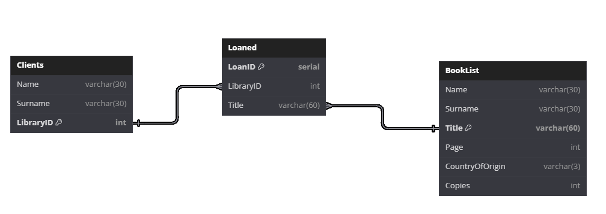

Aplikacja - sprawozdanie
========================

Adres do githuba sprawozdania: https://github.com/Albandon/Sprawozdanie-dbms 

Zalożenia
---------

Zanim przejdziemy do przedstawienia modelu bazy danych oraz instrukcji ważnym jest by przedstawić założenia, którymi się kierowałem tworząc funkcjonalność aplikacji oraz bazę danych.

- Ksiażka może mieć tylko jednego autora, w celu ułatwienia oraz ponieważ biblioteka będzie przechowywać głownie literaturę popularną. Jeżeli jednak chcielibyśmy dodać wielu autorów dodajemy tylko autora wymienionego jako pierwszego.
- Biblioteka zakłada że nie wymaga dużego zakresu kart bibliotecznych, więc w celu zapewnienia operacji przez dłuższy czas oraz by umożliwić skalarność przydzielamy 6-znakowe id.
- Klient może wypożyczyć tylko jedną książkę (nie wydajne, ale posiada dwa rozwiązania, o których później).
- Wprowadzanie danych do bazy lokalnej jest głównie w celu zabezpieczeń przed błędami (użytkownik może sprawdzić czy na pewno wypożyczono odpowiednią książkę)
- import danych do bazy głównej może wprowadzić lub zastąpić dane w przypadku konfliktu nowymi pozyskanymi z pliku csv
- Ponieważ baza lokalna, będzie w tym przypadku używana tylko w bibliotece zakładamy, że nie będziemy posiadać wielu jej instancji, a jedynie jedną aktywną wersję na jednym urządzeniu
- aktualizacja danych do bazy zdalnej będzie przeprowadzana pod koniec zmiany lub dnia pracy 

Modele bazy danych
------------------

Wedle założeń obecny model pozwala na wprowadzenie ksiażek, unikatowych pod względem Tytułu oraz na wypożyczenie jednej ksiażki na ID biblioteczne.

Model koncepcyjny
~~~~~~~~~~~~~~~~~
Model ten przedstawia związki między danymi oraz wstępnie definiuje potrzeby jakie spełniać będzie musiał model fizyczny. W naszym przypadku przedstawia on więc dwie tabele zawierające odpowiednie dane oraz jeden związek między nimi.
Wygląda on w następujący sposób:

Model fizyczny
~~~~~~~~~~~~~~

Fizyczny model przedstawia już dokładne zależności oraz ustalone typy danych.

Jak wspominałem wcześniej jednym z problemów obecnego modelu jest ograniczenie do posiadania jednej ksiażki wypożyczonej jako limit dla każdego klienta.
Jednym ze sposobów na obejście tego problemu byłoby zmienienie ID w tabeli 'Clients' na id wypożyczenia, a więc tranzakcji. Mogłoby to utrudnić sytuację, w której mamy wiele osób o tym samym nazwisku, jednak przy założeniu, że biblioteka nie operowała by w miejscu z dużą populacją było by to potencjalnie dobre rozwiązanie.
Drugim sposobem natomiast jest zmiana bazy danych by podążała wedle następującego modelu:

Rozwiązałoby to napewno wspomniany problem, oraz uprościłoby też strukturę, jak i proces samego wypożyczania

Instrukcja
----------
Instrukcje podane niżej dotyczą działania funkcji z poziomu programu. Dodatkowo pozwalają też zrozumieć działanie aplikacji z perspektywy użytkownika.

Dodatkowa informacja dot. Aplikacji
"""""""""""""""""""""""""""""""""""

Aplikacja składa sie z dwóch trybów
- standardowego
- trybu bazy danych (database mode)

W pierwszym mamy dostęp do funkcji umożliwiających dodanie odpowiednich wpisów. W drugim natomiast zyskujemy dostęp do funkcji zaawansowanych takich jak:
- modyfikacja danych 
- usuwanie danych 
- wykonywanie i wyświetlanie zapytań
- oraz sortowanie tabel

Wszystkie funkcje są opsługiwane przez dialog z użytkownikiem, który wybiera odpowiednie czynności lub podaje odpowiednie dane w odpowiedzi. Wszystkie dane wprowadzane są wcześniej sprawdzane pod kątem zgodności.

DBHandling
~~~~~~~~~~

**Funkcje wporowadzające dane do lokalnej bazy danych oraz te pozwalające zarządzanie nią.**

.. automodule:: Aplikacja.DBHandling
   :members:
   :undoc-members:
   :show-inheritance:
   
postgress
~~~~~~~~~

**Funkcje wporowadzające dane do zdalnej bazy danych. Umożliwiaja także budowę zadanych danych.**

.. automodule:: Backend.postgress 
   :members:
   :undoc-members:
   :show-inheritance:

